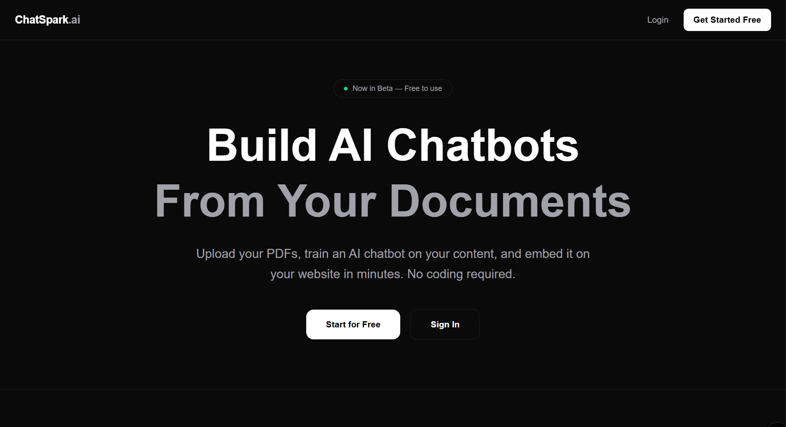
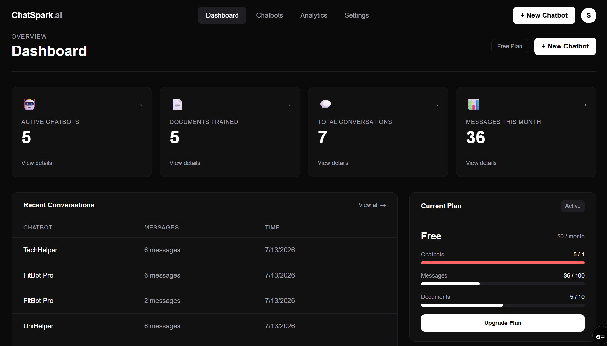
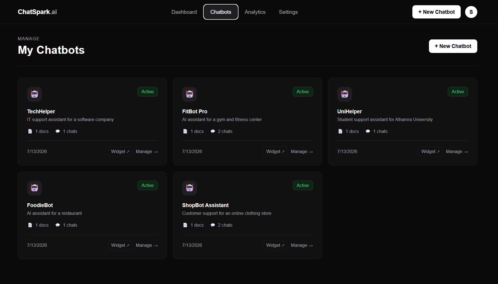
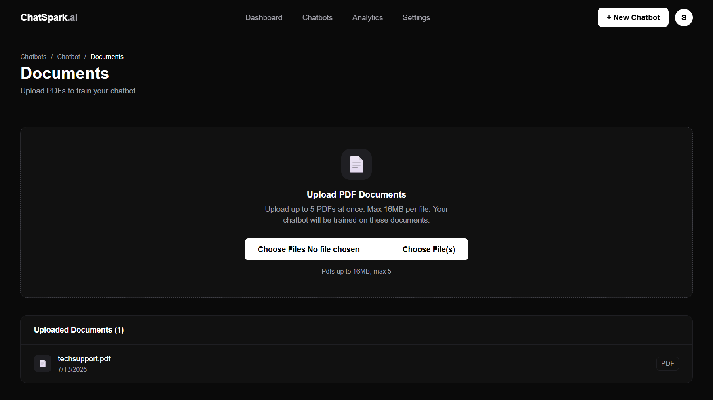
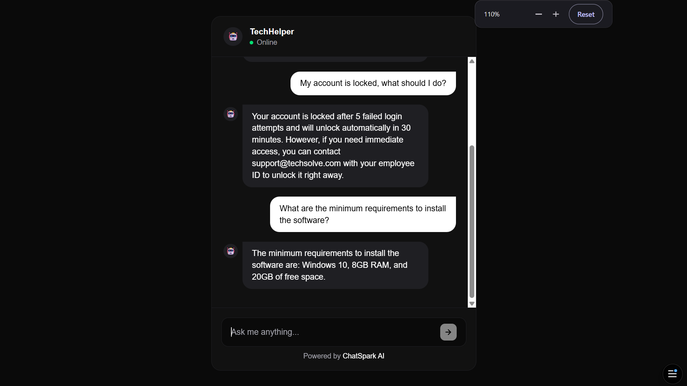
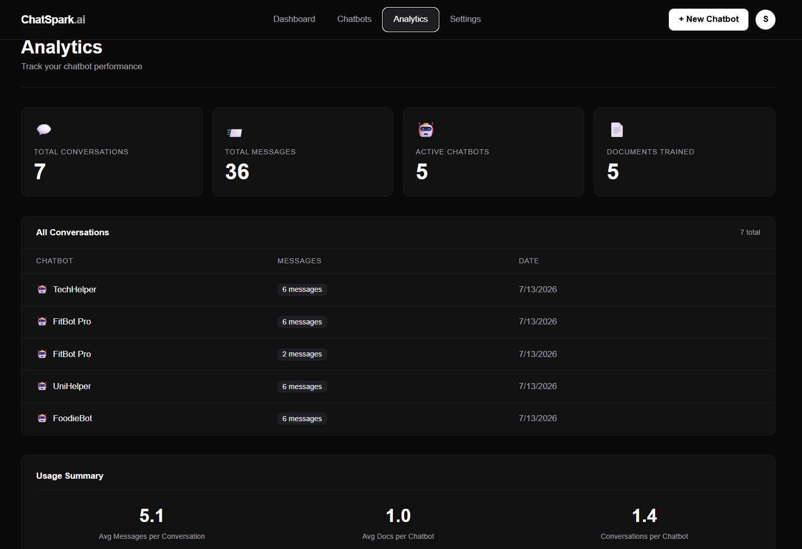

<div align="center">

# 🤖 ChatSpark AI — AI Chatbot SaaS

**Upload your documents, train an AI chatbot on your content, and embed it on any website in minutes.**

[](https://nextjs.org)
[](https://www.typescriptlang.org)
[](https://supabase.com)
[](https://prisma.io)
[](https://tailwindcss.com)
[](https://groq.com)
[](https://vercel.com)

</div>

---

## 🚀 Live Demo

**[View ChatSpark AI →](https://chatspark-ai-9hwh.vercel.app/)**


---

## 📸 Screenshots


| Landing Page | Dashboard | Chatbots |
| :---: | :---: | :---: |
|  |  |  |

| Upload Documents | Chat Widget | Analytics |
| :---: | :---: | :---: |
|  |  |  |

---

## ✨ Features

- 🔐 **Auth System** — Email/password and GitHub OAuth with NextAuth.js v5, JWT sessions, bcrypt hashing
- 🤖 **AI Chatbot Builder** — Create unlimited chatbots, each trained on your own documents
- 📄 **PDF Processing** — Upload PDFs, text extracted automatically using `unpdf`, chunked and vectorized
- 🧠 **RAG Architecture** — Retrieval Augmented Generation using pgvector similarity search + Groq Llama 3.3
- 🔗 **Widget Embedding** — One line of code to embed your chatbot on any website
- 📊 **Analytics Dashboard** — Track conversations, messages, and chatbot performance
- 💬 **Real-time Chat** — Streaming AI responses with typing indicators and conversation history
- 📱 **Fully Responsive** — Works perfectly on mobile, tablet, and desktop
- ⚡ **Framer Motion** — Smooth animations and transitions throughout the app
- ☁️ **Cloud Deployed** — Vercel (frontend + backend) + Supabase (PostgreSQL + pgvector)

---

## 🛠️ Tech Stack

| Technology | Purpose |
|---|---|
| **Next.js 16 (App Router)** | Full-stack framework |
| **TypeScript** | Type safety everywhere |
| **Tailwind CSS** | Utility-first styling |
| **NextAuth.js v5** | Authentication (GitHub OAuth + Credentials) |
| **PostgreSQL + Supabase** | Cloud relational database |
| **Prisma 6.x ORM** | Type-safe database queries |
| **pgvector** | Vector similarity search for RAG |
| **Hugging Face** | Text embeddings (384 dimensions) |
| **Groq API** | LLM inference (Llama 3.3 70B) |
| **Uploadthing** | PDF file storage |
| **unpdf** | Serverless PDF text extraction |
| **Framer Motion** | Animations and transitions |
| **Zod** | Schema validation |
| **bcryptjs** | Password hashing |

---

## 🏗️ Architecture

```text
User uploads PDF
      ↓
unpdf extracts text
      ↓
Text chunked into 500-word segments
      ↓
Hugging Face converts each chunk to a 384   -dim vector
      ↓
Vectors stored in pgvector (Supabase)
      ↓
Customer asks question in widget
      ↓
Question converted to vector
      ↓
pgvector finds top 5 similar chunks
      ↓
Chunks + question sent to Groq (Llama 3.3)
      ↓
Answer streamed back to customer
      ↓
Conversation saved to database
```

---

## 🗂️ Project Structure

```text
chatspark-ai/
├── app/
│   ├── (auth)/
│   │   ├── login/page.tsx
│   │   └── register/page.tsx
│   ├── (dashboard)/
│   │   └── dashboard/
│   │       ├── layout.tsx
│   │       ├── page.tsx
│   │       ├── chatbots/
│   │       │   ├── layout.tsx
│   │       │   ├── page.tsx
│   │       │   ├── new/
│   │       │   │   ├── layout.tsx
│   │       │   │   └── page.tsx
│   │       │   └── [id]/
│   │       │       ├── layout.tsx
│   │       │       ├── page.tsx
│   │       │       ├── documents/
│   │       │       │   ├── layout.tsx
│   │       │       │   └── page.tsx
│   │       │       ├── appearance/page.tsx
│   │       │       └── embed/
│   │       │           ├── layout.tsx
│   │       │           └── page.tsx
│   │       ├── analytics/
│   │       │   ├── layout.tsx
│   │       │   └── page.tsx
│   │       ├── profile/
│   │       │   ├── layout.tsx
│   │       │   └── page.tsx
│   │       ├── billing/
│   │       │   ├── layout.tsx
│   │       │   └── page.tsx
│   │       └── settings/
│   │           ├── layout.tsx
│   │           └── page.tsx
│   ├── api/
│   │   ├── auth/
│   │   ├── chat/route.ts
│   │   ├── chatbot/
│   │   ├── document/
│   │   ├── widget/
│   │   ├── uploadthing/
│   │   └── dashboard/stats/
│   └── widget/
│       └── [id]/
│           ├── layout.tsx
│           └── page.tsx
├── components/
│   ├── auth/
│   └── dashboard/
├── lib/
│   ├── auth.ts
│   ├── prisma.ts
│   ├── embeddings.ts
│   ├── groq.ts
│   └── uploadthing.ts
├── prisma/
│   └── schema.prisma
└── proxy.ts
```

---

## 🔌 API Endpoints

```text
POST   /api/auth/register          Create new account
GET    /api/auth/[...nextauth]      NextAuth handler
POST   /api/chatbot                 Create chatbot
GET    /api/chatbot                 Get all chatbots
GET    /api/chatbot/[id]            Get single chatbot
POST   /api/document                Save document + generate embeddings
GET    /api/document                Get documents by chatbot
POST   /api/document/extract        Extract text from PDF
POST   /api/chat                    RAG chat endpoint
GET    /api/widget/[id]             Get chatbot for widget
GET    /api/dashboard/stats         Get dashboard statistics
PATCH  /api/user/profile            Update user profile
DELETE /api/user/profile            Delete account
PATCH  /api/chatbot/[id]            Update chatbot settings
DELETE /api/chatbot/[id]            Delete chatbot
DELETE /api/user/profile            Delete account
```

---

## 🏁 Getting Started

```bash
# 1. Clone the repository
git clone https://github.com/Samiullah-2004/Chatspark-ai.git
cd chatspark-ai

# 2. Install dependencies
npm install

# 3. Set up environment variables
cp .env.example .env
# Fill in .env with your keys (see below)

# 4. Push database schema
npx prisma db push

# 5. Run the dev server
npm run dev
```

### Environment Variables

```env
DATABASE_URL=your_supabase_connection_string

NEXTAUTH_SECRET=your_random_secret
NEXTAUTH_URL=http://localhost:3000

GITHUB_CLIENT_ID=your_github_oauth_client_id
GITHUB_CLIENT_SECRET=your_github_oauth_client_secret

GROQ_API_KEY=your_groq_api_key
HUGGINGFACE_API_KEY=your_huggingface_token
UPLOADTHING_TOKEN=your_uploadthing_token
```

---

## 📐 Database Schema

```text
User          → accounts, sessions, chatbots
Chatbot       → documents, conversations
Document      → embeddings
Embedding     → vector(384) for pgvector search
Conversation  → messages
Message       → role (user/assistant), content
```

---

## 🚢 Deployment

- **Frontend + Backend** — Vercel (Next.js API routes as serverless functions)
- **Database** — Supabase PostgreSQL with pgvector extension

Required Vercel environment variables: same as `.env` above.

---

## 👤 Author

**Samiullah Akram**
Full Stack Web Developer from Lahore, Pakistan 🇵🇰

[](https://github.com/Samiullah-2004)
[](https://www.linkedin.com/in/samiullah-akram-a28461404/)
[](mailto:samiullah.akram.3009@gmail.com)
[](https://www.upwork.com/freelancers/~01ffa5cf678d8eff63)

---

## 📄 License

Open source for personal and educational use. Credit appreciated if used as reference.

---

<div align="center">

**Built with 🤖 by Samiullah Akram, 2026**

</div>